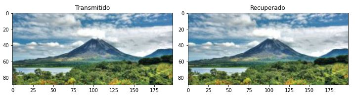
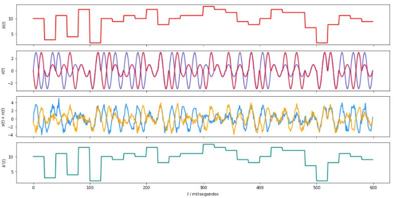
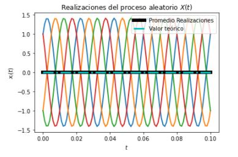

# Proyecto4
##### Nombre: Diana Sancho Salazar
##### Carné: B77158
##### Grupo: 2

### 4.1. - Modulación 16-QAM
Realice una simulación del sistema de comunicaciones, utilizando una modulación 16-QAM. Deben mostrarse las imágenes enviadas y recuperadas y las formas de onda.

Con la modulación 16-QAM, al recibir la imagen de la izquierda y modularla y desmodularla, se logró transmitir correctamente y se obtuvo la imagen de la izquierda. Exactamente la misma.

También se obtuvo la forma de las ondas al hacer todo este proceso como se muestra en la siguiente imagen.

### 4.2. - Estacionaridad y ergodicidad
Realice pruebas de estacionaridad y ergodicidad a la señal modulada senal_Tx y obtenga conclusiones sobre estas.

El proceso de estacionaridad y ergocidad es una distribución de probabilidad que varía de una forma constante a lo largo de cierto periodo de tiempo. Como se observa en la imagen del resultado se obtuvieron ondas relativamente constantes que ccoinciden con la definición de este proceso. También se muestra el periodo de tiempo que se utiliza para esto.

### 4.3. - Densidad espectral de potencia
Determine y grafique la densidad espectral de potencia para la señal modulada senal_Tx.

Se muestra como para cada frecuencia la energía varía, mostrando la variación ante la transmisión de la imagen, en función de la frecuencia.

