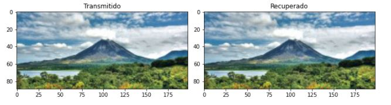

# Proyecto4
##### Nombre: Diana Sancho Salazar
##### Carné: B77158
##### Grupo: 2

### 4.1. - Modulación 16-QAM
Realice una simulación del sistema de comunicaciones, utilizando una modulación 16-QAM. Deben mostrarse las imágenes enviadas y recuperadas y las formas de onda.

Con la modulación 16-QAM, al recibir la imagen de la izquierda y modularla y desmodularla, se logró transmitir correctamente y se obtuvo la imagen de la izquierda. Exactamente la misma.

También se obtuvo la forma de las ondas al hacer todo este proceso como se muestra en la siguiente imagen.

### 4.2. - Estacionaridad y ergodicidad

